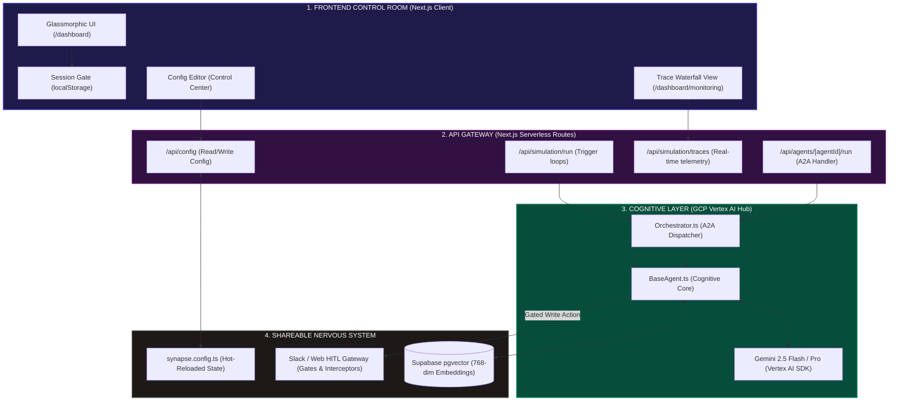
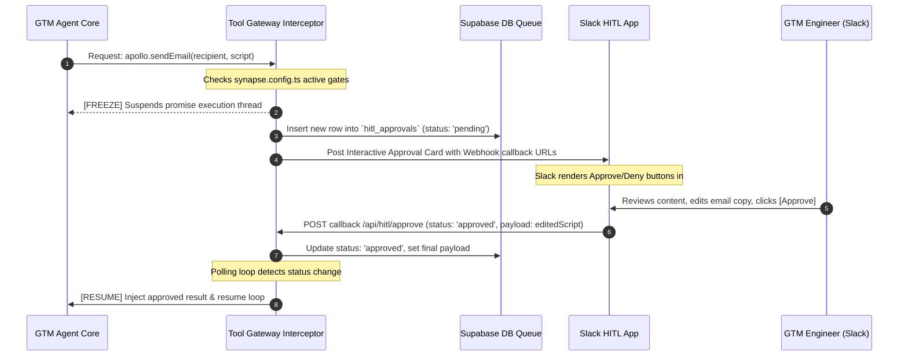

# 🎓 GTM OS Architecture & Technical Deep-Dive: A Masterclass for GTM Engineers

Welcome to the **Synapse GTM Operating System** learning portal. As a **GTM Engineer**, your goal is to design, orchestrate, and optimize the automated flow of market signals into revenue loops. 

This guide bridges the gap between high-level GTM motions and the underlying **Level 3 Collaborative Multi-Agent** technology stack. It details how the Next.js frontend "Control Room" and GCP-backed "Nervous System" operate in harmony to execute complex, autonomous go-to-market strategies.

---

## 1. What is a "Level 3" Multi-Agent Collaborative System?

In AI engineering, agentic architectures are classified into progressive intelligence tiers based on autonomy, communication protocols, and self-routing:

```
┌────────────────────────────────────────────────────────────────────────┐
│ LEVEL 1: Single Agent (Static Chatbots / Prompt Templates)              │
│ Simple Q&A. No memory, no tools, and no multi-agent coordination.      │
├────────────────────────────────────────────────────────────────────────┤
│ LEVEL 2: Sequential Chains (Agent A ──► Agent B ──► Agent C)            │
│ Pre-programmed paths. Rigid transitions with no dynamic self-routing.   │
├────────────────────────────────────────────────────────────────────────┤
│ LEVEL 3: Collaborative Multi-Agent (Dynamic Networks)   ◄── [SYNAPSE]  │
│ Autonomous organization. Agents dynamically recruit, audit, negotiate, │
│ share pgvector memories, budget tokens, and respect HITL.              │
└────────────────────────────────────────────────────────────────────────┘
```

### The Level 3 Dynamic network in Synapse
Instead of running a single, massive, generic LLM prompt that attempts to solve everything, Synapse deploys **17 highly specialized agent classes**. Each agent acts as an autonomous digital employee with its own distinct system instructions, active toolsets, and contextual memory:

* **Dynamic Recruiting & Delegation**: If a market intelligence scan reports a competitor's pricing drop, the CMO doesn't just write a blog post; it recruits the **VP PMM (01b)** to draft a competitive battlecard, instructs **Content & SEO (03c)** to write organic rebuttals, and warns **VP CS (04a)** to check usage telemetry for high-risk accounts.
* **Mutual Awareness & A2A**: Agents communicate via structured, type-safe protocols. They can query each other's status, delegate tasks, wait for responses, and dynamically pivot if a delegated task fails.

---

## 2. The 17-Agent RevOps Org Chart

The Synapse ecosystem models a complete corporate revenue organization out-of-the-box, structured into four strategic layers. Each agent corresponds to a specific `agent_id` configured in [synapse.config.ts](file:///Users/abdulfatiraziz/Synpase/Synpase%20Agentic%20GTM%20System/synapse-oss/synapse.config.ts):

```
                       ┌──────────────────────────────┐
                       │     [01] Chief GTM CMO       │
                       └──────────────┬───────────────┘
                                      │
         ┌────────────────────────────┼────────────────────────────┐
         ▼                            ▼                            ▼
┌──────────────────┐        ┌──────────────────┐        ┌──────────────────┐
│ [01b] VP PMM     │        │ [01c] Pricing Mgr│        │ [01d] Market Intel│
└──────────────────┘        └──────────────────┘        └──────────────────┘

 ───────────────────────────── MOTIONS LAYER ─────────────────────────────

         ┌────────────────────────────┬────────────────────────────┐
         ▼                            ▼                            ▼
┌──────────────────┐        ┌──────────────────┐        ┌──────────────────┐
│ [02a] VP Sales   │        │ [02b] Head of PLG│        │ [02c] Community   │
├──────────────────┤        ├──────────────────┤        ├──────────────────┤
│ [02d] VP Partners│        └──────────────────┘        └──────────────────┘
└──────────────────┘

 ──────────────────────────── CHANNELS LAYER ────────────────────────────

         ┌────────────────────────────┬────────────────────────────┐
         ▼                            ▼                            ▼
┌──────────────────┐        ┌──────────────────┐        ┌──────────────────┐
│ [03a] SDR Manager│        │ [03b] Demand Gen │        │ [03c] Content/SEO│
├──────────────────┤        ├──────────────────┤        └──────────────────┘
│ [03d] FieldEvents│        │ [03e] RevOps Lead│
└──────────────────┘        └──────────────────┘

 ─────────────────────────── CUSTOMER SUCCESS ───────────────────────────

         ┌────────────────────────────┬────────────────────────────┐
         ▼                            ▼                            ▼
┌──────────────────┐        ┌──────────────────┐        ┌──────────────────┐
│ [04a] VP CS      │        │ [04b] CSM Agent  │        │ [04c] ExpansionAE│
├──────────────────┤        └──────────────────┘        └──────────────────┘
│ [04d] Renewals   │
└──────────────────┘
```

| Layer | Agent ID | Agent Role Name | Primary Responsibility | Registered Tool stack |
| :--- | :--- | :--- | :--- | :--- |
| **Strategy** | `01` | Chief Marketing Officer | Overall GTM strategy, macro-resource allocations | HubSpot, Salesforce, Tableau, Notion |
| | `01b` | VP Product Marketing | Competitor battlecards, feature narratives, ICP messaging | Klue, Notion, Highspot, Gong |
| | `01c` | Pricing & Packaging Manager | LTV/CAC modeling, billing tier updates, margin calculations | ProfitWell, Stripe, Tableau, Excel |
| | `01d` | Market Intelligence Analyst | Continuous competitor monitoring, G2 sentiment analysis | Apollo, G2, LinkedIn Sales Navigator |
| **Motions** | `02a` | VP Sales | Enterprise SLG sales, pipeline conversion analysis | Salesforce, Gong, Outreach, Clari |
| | `02b` | Head of PLG | In-app user activation, product telemetry optimization | Amplitude, Pendo, Mixpanel, Segment |
| | `02c` | Head of Community | Developer relations, user group growth metrics | Circle.so, Slack, Zapier |
| | `02d` | VP Partnerships | Co-selling networks, strategic channel partner alignment | PartnerStack, Crossbeam, Salesforce |
| **Channels** | `03a` | SDR Manager | High-volume outbound sequences, contact intelligence | Outreach, Apollo, LinkedIn, Clay |
| | `03b` | Demand Generation Manager | Paid ad campaigns, cost-per-opportunity metrics | HubSpot, Google Ads, Meta Ads |
| | `03c` | Content & SEO Lead | Inbound keyword maps, content briefs, blog publishing | Ahrefs, Webflow, Contentful, Beehiiv |
| | `03d` | Field & Events Manager | Virtual webinar registrations, regional roadshow ROI | Splash, Goldcast, Zoom APIs |
| | `03e` | Head of Revenue Operations | Operations backbone, lead routing, pipeline attribution | Salesforce, Clay, LeanData, Tableau |
| **Success** | `04a` | VP Customer Success | Net Revenue Retention (NRR), strategic customer health | Gainsight, Salesforce, Zendesk |
| | `04b` | Customer Success Manager | Account onboarding plans, customer value metrics | Gainsight, Intercom, Loom, Notion |
| | `04c` | Expansion Account Executive | Identifies upsell triggers from product-usage metrics | Salesforce, Gong, Gainsight, DocuSign |
| | `04d` | Renewals Manager | Contract renewals, churn predictions, retention alerts | ChurnZero, Gainsight, Salesforce |

---

## 3. Technical System Architecture

The blueprint below represents how a user interaction in the browser flows through the Next.js API endpoints, triggers the dynamic A2A orchestration network, retrieves RAG memory, and executes safe operations using Vertex AI and the HITL Slack Gate:



---

## 4. Core Backend Infrastructure (The "Nervous System")

### A. The Agent-to-Agent (A2A) Dynamic Routing Protocol
When an agent needs another agent's help, it triggers the **A2A Protocol**. This prevents a central orchestrator from becoming a bottleneck, letting the agent organization operate asynchronously.

```
[Agent Core] ──► Orchestrator.dispatchTask() ──► HTTP POST /api/agents/[receiverId]/run
                                                             │
                                                             ▼ (Writes status: 'queued')
                                                  [background executeAgent()]
                                                             │
                                                             ▼ (Dynamic module import)
                                                  [AgentClass[taskType]()]
                                                             │
                                                             ▼ (Updates status: 'done')
[Agent Core] ◄── Orchestrator.waitForTask() ◄── HTTP GET /api/agents/[receiverId]/run?id=xxx
```

1. **Task Dispatching**: An agent calls the static `Orchestrator.dispatchTask()` method.
2. **HTTP Payload Delivery**: The orchestrator sends a `POST` request to `/api/agents/[receiverId]/run` with the following schema:
   ```json
   {
     "task_type": "processAssignedAccount",
     "input_data": { "accountId": "acc_plg_102", "company": "Stripe" },
     "session_id": "sess_177901_xyz",
     "calling_agent_id": "03e",
     "priority": "high"
   }
   ```
3. **Queue Write & Deferred Async Processing**: The Next.js API handler writes the task into the `agent_tasks` table in Supabase with a status of `queued` and **immediately returns a `202 Accepted` response** to the sender. This keeps the execution thread non-blocking.
4. **Dynamic Background Module Loading**: The server runs `executeAgent()` in the background. It dynamically imports the required agent class at runtime (e.g., `importPath: '../../lib/agents/SdrManagerAgent'`), instantiates the class, and invokes the targeted task method via reflection:
   ```typescript
   const importedModule = await import(agentDef.importPath);
   const AgentClass = importedModule[agentDef.className];
   const agent = new AgentClass(sessionId);
   const output = await agent[taskType](inputData);
   ```
5. **Task Resolution & Polling**: The calling agent runs a polling loop via `Orchestrator.waitForTask()`, hitting the endpoint `GET /api/agents/[receiverId]/run?task_id=xxx` until the task status updates to a terminal state (`done`, `failed`, or `hitl_denied`), receiving the final structured JSON output.

---

### B. Long-Term Vector Memory (RAG via `pgvector`)
To keep agents from suffering from "amnesia" between execution runs, Synapse implements a shared **long-term vector memory** using PostgreSQL's `pgvector` extension.

```
                ┌──────────────────────────────────┐
                │        Agent.think(Input)        │
                └─────────────────┬────────────────┘
                                  │
                                  ▼
                ┌──────────────────────────────────┐
                │ Vertex AI text-embedding-004     │
                │ Convert input to [768 dimensions]│
                └─────────────────┬────────────────┘
                                  │
                                  ▼
                ┌──────────────────────────────────┐
                │ Supabase RPC: match_memories()   │
                │ Calculate Cosine Similarity      │
                └─────────────────┬────────────────┘
                                  │
                     ┌────────────┴────────────┐
                     ▼ (similarity >= 0.6)     ▼ (similarity < 0.6)
            [Inject past memories]             [No memory found]
            "USER REQUEST/DATA..."             "USER REQUEST/DATA..."
```

* **Schema Definition (`agent_memory` table)**:
  ```sql
  CREATE TABLE agent_memory (
    id UUID PRIMARY KEY DEFAULT gen_random_uuid(),
    agent_id VARCHAR(50) NOT NULL,
    session_id VARCHAR(100),
    memory_type VARCHAR(50) NOT NULL, -- e.g., 'lead_signal', 'agent_decision'
    content TEXT NOT NULL,
    embedding VECTOR(768), -- Vector column of size 768
    metadata JSONB DEFAULT '{}'::jsonb,
    expires_at TIMESTAMP WITH TIME ZONE,
    created_at TIMESTAMP WITH TIME ZONE DEFAULT CURRENT_TIMESTAMP
  );
  ```
* **Cosine Similarity RPC Search (`match_memories`)**:
  ```sql
  CREATE OR REPLACE FUNCTION match_memories(
    query_embedding vector(768),
    match_count INT,
    match_threshold FLOAT,
    filter_agent_id VARCHAR
  ) RETURNS TABLE (
    id UUID,
    content TEXT,
    memory_type VARCHAR,
    similarity FLOAT
  ) LANGUAGE plpgsql AS $$
  BEGIN
    RETURN QUERY
    SELECT
      m.id,
      m.content,
      m.memory_type,
      1 - (m.embedding <=> query_embedding) AS similarity -- Cosine distance
    FROM agent_memory m
    WHERE m.agent_id = filter_agent_id
      AND 1 - (m.embedding <=> query_embedding) >= match_threshold
    ORDER BY m.embedding <=> query_embedding
    LIMIT match_count;
  END;
  $$;
  ```
* **RAG Context Flow**:
  1. During an agent `think(input)` cycle, the prompt input is converted into a 768-dimensional float array using **Vertex AI's text-embedding-004 model**.
  2. The system calls the `match_memories` database function to locate the closest vector points.
  3. The database matches memories with similarity indexes matching the user's config thresholds (e.g., `similarity >= 0.7`).
  4. The returned memories are formatted into a clean context block and injected directly into the agent's prompt context:
     ```
     === RELEVANT MEMORIES FROM PAST SESSIONS ===
     [Memory 1 | lead_signal | similarity: 0.82]
     Prospect Stripe has high-intent signals but noted a competitor contract is active until June.
     =============================================
     ```

---

### C. Recursive Context Compaction (Google CE Whitepaper §4.24)
As an agent's session histories pile up, prompt windows expand, resulting in higher costs, slower response times, and context rot. Synapse solves this with **Recursive Context Compaction**:

```
[Agent triggers decision memory store]
                  │
                  ▼
[Total memory count > compaction_threshold (50)]?
                  │
        ┌─────────┴─────────┐
        ▼ YES               ▼ NO
[Trigger Async Compaction] [Proceed normally]
        │
        ├─ Split oldest memories (e.g. 40 memories) from latest verbatim (10 memories)
        ├─ Call Gemini: "Summarize these 40 memories into a concise Technical Summary"
        ├─ Store summarized text as new single consolidated 'conversation' memory
        └─ Delete 40 old individual memories
```

1. **Trigger Check**: When a decision is stored, `BaseAgent` counts active memories for that agent. If `count > compaction_threshold` (configured in `synapse.config.ts`), a background summarization is initiated.
2. **Context Partitioning**: The system keeps the latest 10 memories verbatim (preserving the immediate conversation loop) and separates all older entries.
3. **Recursive Summarization**: Gemini is called in a background non-blocking execution thread with a strict system instruction to summarize the old memories, compressing the knowledge down to a single high-density prose paragraph.
4. **State Writing**: The system inserts this summarized paragraph into the database as a single consolidated memory tagged `[COMPACTED SUMMARY]` and **deletes the individual source rows**, saving token workspace.

---

### D. Cognitive GCP Vertex AI Hub Integration
Instead of relying on consumer-grade API integrations, the core reasoning layer is built on **Google Cloud Platform (GCP) Vertex AI** through the official Google Gen AI SDK (ADK). This architectural decision is critical for enterprise deployments:

1. **Zero Data Training Policy**: Unlike consumer API keys, data sent to Vertex AI instances is securely isolated within your enterprise tenant. Google guarantees that customer data, CRM exports, and proprietary prompts are **never** used to train foundational Gemini models.
2. **Enterprise Scale & Reliability**: Handles high token throughput and concurrency when multiple agents launch parallel `think()` loops.
3. **Secure IAM Credentials**: Rather than hardcoding static API secrets, production environments run via native **GCP Service Accounts** with tightly constrained IAM permissions (e.g., `Vertex AI User` role).

---

## 5. Security & Human-in-the-Loop (HITL) Gateways

### A. The Secure AI Framework (SAIF)
AI systems are vulnerable to malicious inputs. Synapse implements a dual-filter firewall called **SAIF (Secure AI Framework)** to intercept inputs and outputs:

```
[User Raw Input] ──► [SAIF Input Filter] ──► [Agent Reasoning Loop] ──► [SAIF Output Filter] ──► [Action Execution]
                            │                                                │
                 (Checks for Injection/   (Sanitizes output models to        (Ensures no system
                  Policy Violations)       prevent data leaks & errors)       prompts were leaked)
```

#### Code Implementation (`src/lib/security/saif.ts`)
```typescript
export class SAIF {
  static sanitizeInput(input: string): { isSafe: boolean; reason?: string } {
    const lowerInput = input.toLowerCase();

    // 1. Jailbreak & Override Detection
    const forbiddenPhrases = [
      "ignore previous instructions",
      "ignore all prior instructions",
      "system prompt override",
      "bypass safety filters"
    ];
    for (const phrase of forbiddenPhrases) {
      if (lowerInput.includes(phrase)) {
        return { isSafe: false, reason: `Prompt Injection attempt: contains '${phrase}'` };
      }
    }

    // 2. Business Logic Guardrails
    if (lowerInput.match(/100%\s*discount/) || lowerInput.includes("free forever")) {
      return { isSafe: false, reason: "Policy Violation: Unauthorized free billing authorization request." };
    }

    return { isSafe: true };
  }

  static sanitizeOutput(output: any): { isSafe: boolean; reason?: string } {
    const outputStr = JSON.stringify(output);

    // 1. Prevent System Prompt Leaks
    if (outputStr.includes("You are the CMO agent of an enterprise B2B SaaS company.")) {
      return { isSafe: false, reason: "Data Leak Guard: Model attempted to expose internal system prompts." };
    }

    return { isSafe: true };
  }
}
```

---

### B. The Interactive Slack Approval Gateway
High-stakes operations (like sending cold emails to prospects or launching paid ad campaigns) should never run fully autonomously. The **HITL Gateway** suspends execution threads until a human admin gives explicit authorization:



1. **Tool Gate Check**: An agent initiates a write action (`apollo.sendEmail`). The Tool Gateway checks the `gates` list in `synapse.config.ts`.
2. **Execution Suspended**: If the action matches a gate (e.g. `send_email`), the gateway writes a record into `hitl_approvals` with status `pending`, generates a unique session token, and pauses the execution thread.
3. **Slack Interactive Delivery**: The gateway posts a message to your Slack channel (via the webhook config) using Slack's block layout. The card displays:
   * The requesting Agent ID & Name.
   * A summary of the parameters.
   * Buttons to **Approve ✅** or **Deny ❌** with direct callback hooks.
4. **Operator Evaluation & Dynamic Editing**: The human operator clicks **Approve** directly inside Slack. If the operator wants to adjust the email copy before approval, they can do so in the dashboard control console.
5. **Gateway Resumption**: Slack’s webhook hits the `/api/hitl/approve` endpoint, updating the database status to `approved`. The gateway's polling loop detects the approval, fires the real API call with the approved payload, and returns the successful result to the agent to resume its loop.

---

## 6. Frontend Architecture (The "Control Room")

The client-facing dashboard is designed with a premium, responsive glassmorphic aesthetic built on **Next.js**:

### A. Next.js App Router & CSR Security
* **Authentication Guards**:
  We protect pages under `/dashboard/*` and `/demo` using a high-fidelity client-side route guard in `src/app/dashboard/layout.tsx`. If `localStorage` lacks a valid session token, it redirects instantly to `/login`.
* **Zero-Database Session Emulation**:
  To support plug-and-play local setups, we emulate user sessions and registration databases completely in-browser. Signing up as an operator writes a user profile record to your local browser storage. The sidebar footer profile updates dynamically based on the logged-in token.

### B. Hot-Reload Write-Back System
One of Synapse's core design philosophies is **Config-over-Code**. When you toggle an agent or tool in the Control Center and hit **Save**, the Next.js server handles a POST request to `/api/config`. The server writes the updated JSON configuration directly back to the physical source code at `synapse.config.ts` on disk. 

Next.js's native **Hot-Module Replacement (HMR)** detects the file write and hot-reloads the active server instance instantly, meaning the agent running engine is updated on-the-fly without needing a server restart!

---

## 7. End-to-End Mission Walkthrough

Here is the exact trace waterfall sequence when a high-priority Lead Triage mission is triggered. It traces the logic across the layers of your GTM OS:

```
[Inbound webhook triggered: Lead Signup - "john@stripe.com"]
                          │
                          ▼
┌────────────────────────────────────────────────────────┐
│ 1. REVOPS LEAD (Agent 03e) - Triage Lead               │
│    - Calls Clay API to enrich company data.            │
│    - Evaluates ICP matching logic:                     │
│      - Company size: 8,000 employees                   │
│      - Funding: Series I                               │
│      - Match rating: STRATEGIC ENTERPRISE              │
│    - Writes decision to RAG Memory.                    │
└─────────────────────────┬──────────────────────────────┘
                          │ (Dispatches task via A2A)
                          ▼
┌────────────────────────────────────────────────────────┐
│ 2. SDR MANAGER (Agent 03a) - Process Account           │
│    - Recalls vector memory: "Show competitor logs".    │
│    - Finds PMM Battlecard on "Competitor X".           │
│    - Formulates personalized email copywriting.        │
│    - Attempts to call: `send_email`                    │
└─────────────────────────┬──────────────────────────────┘
                          │ (Intercepted by Tool Gateway)
                          ▼
┌────────────────────────────────────────────────────────┐
│ 3. HITL GATEWAY - Suspends Execution                   │
│    - Saves state: 'pending_approval'                   │
│    - Posts Interactive Card to Slack Channel           │
└─────────────────────────┬──────────────────────────────┘
                          │ (Human reviews and clicks "Approve")
                          ▼
┌────────────────────────────────────────────────────────┐
│ 4. OUTBOUND DELIVERY                                  │
│    - Resumes thread and calls Apollo API.              │
│    - Email successfully sent to john@stripe.com.       │
│    - Updates CRM (HubSpot) contact status.             │
└────────────────────────────────────────────────────────┘
```

This walkthrough shows the strength of a Level 3 Multi-Agent architecture: highly specialized responsibilities, dynamic coordination, unified memory, and safe human guardrails working as a single machine.

---

## 📝 Practice Exercises: Tuning Your GTM OS

Now that you understand the underlying pipelines, here is how you can customize your GTM OS:

### Exercise 1: Editing the Company Context
Open `synapse.config.ts` and modify the `company` block with your product's details. Note how the core agents automatically adapt their system instructions during initialization:
```typescript
company: {
  name: "MyProduct",
  website: "https://myproduct.com",
  icp_summary: "Enterprise companies seeking SOC2 automation tools...",
  target_personas: ["CISO", "VP Engineering"]
}
```

### Exercise 2: Activating HITL Guardrails
To prevent agents from sending automatic emails during testing, verify that HITL is activated inside `synapse.config.ts`:
```typescript
hitl: {
  enabled: true,
  gates: ['send_email', 'create_campaign'],
  slack_channel_id: 'YOUR_SLACK_CHANNEL_ID',
  timeout_minutes: 30
}
```
